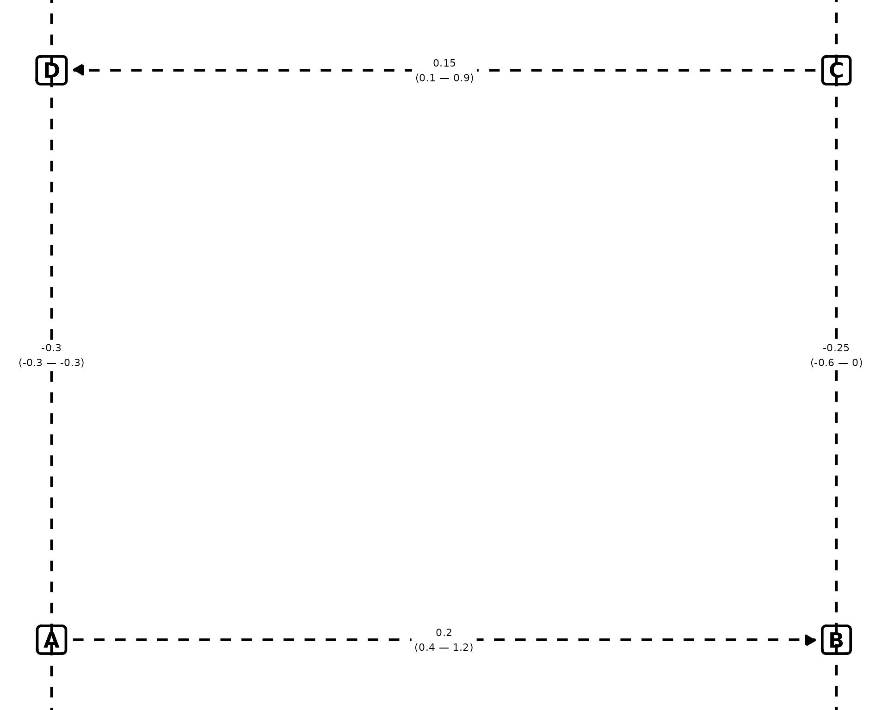
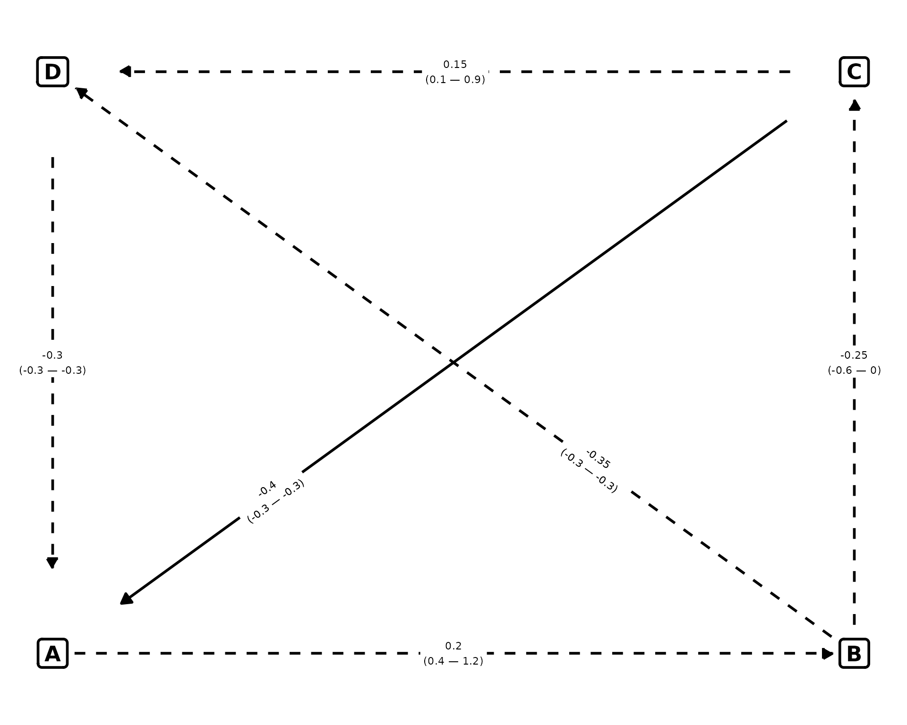

# How-to-use

## Prerequisites

    library(Lmisc)
    library(dplyr)
    library(ggplot2)

First we need to build two dataframes; one containing info for the nodes
and one containing for the lines

The node dataframe must contain the columns below. Each row represents a
node.

``` r


nodes <- data.frame(
    node_id = c("A", "C", "B", "D"),
    label = c("A", "C", "B", "D"),
    x = c(0, 14, 14, 0),
    y = c(0, 3, 0, 3)
  )
```

The dataframe below describes the relationship between the
aforementioned nodes.

- `from` and `to` indicate the start and the end node.

- `curvature` takes two values; 1 means the line should be curved and 0
  that it’s a straight line.

- `pvalue`, `est`, `ci.upper`, `ci.lower` are the p-value, the estimate,
  upper confidence interval and the lower confidence interval of the
  estimate. These are drawn on top of the lines

- `vjust` and `hjust` indicates the vertical and horizontal offset for
  the text on top of the line

- `gap` controls the gap between the boxes and the start/end of the
  straight line positive values increase the length of the line and
  negative values do the opposite. gap=0 means that the line start and
  ends at the exact centers of the boxes. Default value is 1. If you
  need granular control, specify the values for each relationship.

- `curvature_amount` controls the curvature of the curved paths. These
  follow the notation of ggplot: positive values mean a right-hand curve
  while negative values a left-hand curve.

``` r


edges <- data.frame(
  from = c(
    "A", "C", "B", "D"
  ),
  to = c(
    "B", "D", "C", "A"
  ),
  curvature = c(0, 0, 0, 0),
  pvalue = c(0.1, 0.30, 0.5, 0.5),
  est = c(
    0.2, 0.15, -0.25, -0.3
  ),
  ci.lower = c(0.4, 0.1, -0.6, -0.3),
  ci.upper = c(1.2, 0.9, 0.0, -0.3),
  hjust = c(0.5, 0.5, 0.5, 0.5),
  vjust = c(0.5, 0.5, 0.50, 0.5),
  curvature_amount = c(
    0, 0, 0, 0
  )
)
```

## Plot

``` r

p <- plot_dag(nodes, edges, ylim = c(-0.2, 3.2), xlim = c(-0.2, 14.2), text_size = 3)
print(p)
```



## Explanation of `curvature_amount`

Imagine you’re walking along the path from start to end:

| Curvature Sign | Curve Direction | What It Looks Like |
|----|----|----|
| Positive (+) | Right-hand curve | Path bends to your right as you walk forward. |
| Negative (−) | Left-hand curve | Path bends to your left as you walk forward. |
| Zero (0) | Straight line | No bending; direct line. |

``` r

edges <- data.frame(
  from = c(
    "A", "C", "B", "D"
  ),
  to = c(
    "B", "D", "C", "A"
  ),
  curvature = c(1, 1, 1, 1),
  pvalue = c(0.1, 0.30, 0.5, 0.5),
  est = c(
    0.2, 0.15, -0.25, -0.3
  ),
  ci.lower = c(0.4, 0.1, -0.6, -0.3),
  ci.upper = c(1.2, 0.9, 0.0, -0.3),
  hjust = c(0.5, 0.5, 0.5, 0.5),
  vjust = c(0.5, 0.5, 0.50, 0.5),
  curvature_amount = c(
    0.2, -0.2, 0.2, -0.2
  )
)
p <- plot_dag(nodes, edges, ylim = c(-2, 3.2), xlim = c(-0.2, 15), text_size = 3)
print(p)
```


When we walk from `D` to `A` (or `C` to `D`) with a negative value
(`curvature_amount = -0.2`), the curved path is left-handed. When we
walk from `B` to `C` (or from `A` to `B`) with a positive value, the
path is right-handed (`curvature_amount = 0.2`).

## Control of gap

We can control the length of the lines by using the `gap` argument.

By using 0, we say that the lines should start from the center of the
boxes. 1 is the default.

- We can assign a *positive* value to increase the length of the lines
- We can assign a *negative* value to shrink the lines

``` r

edges <- data.frame(
  from = c(
    "A", "C", "B", "D", "B", "C"
  ),
  to = c(
    "B", "D", "C", "A", "D", "A"
  ),
  curvature = c(0, 0, 0, 0, 0, 0),
  pvalue = c(0.1, 0.30, 0.5, 0.5, 0.5, 0.005),
  est = c(
    0.2, 0.15, -0.25, -0.3, -0.35, -0.4
  ),
  ci.lower = c(0.4, 0.1, -0.6, -0.3, -0.3, -0.3),
  ci.upper = c(1.2, 0.9, 0.0, -0.3, -0.3, -0.3),
  hjust = c(0.5, 0.5, 0.5, 0.5, 0.3, 0.8),
  vjust = c(0.5, 0.5, 0.50, 0.5, 0, 0),
  curvature_amount = c(
    0, 0, 0, 0,0,0
  )
)

# Set the gap values
edges$gap <- c(-1, -3, -1, -3, -1,-3)

plot_dag(nodes, edges, ylim = c(-0.2, 3.2), xlim = c(-0.2, 14.2), text_size = 3)
```



As you can see, those relationships that have `-3` as their gap values
have their length shrinken.
